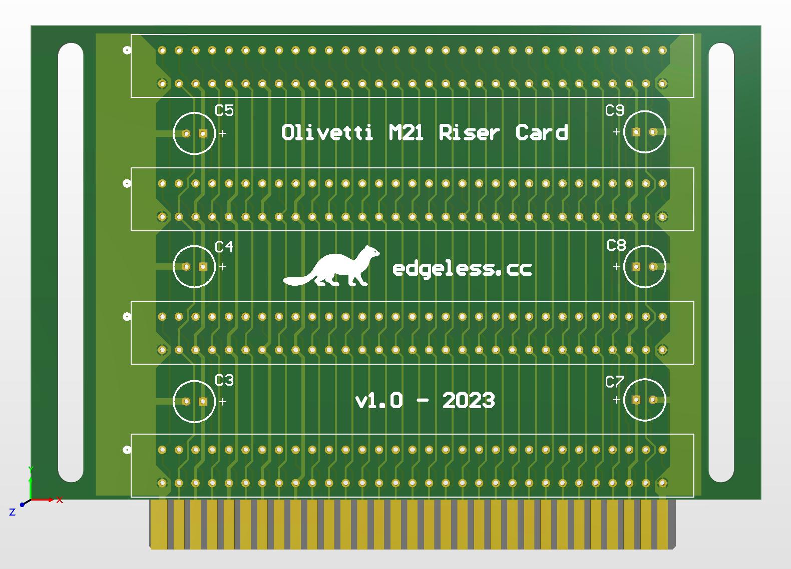

# Olivetti M21 PC (1983) ISA riser card

The Olivetti M21 Personal Computer is one of the first "portable" (luggable) computer systems, introduced in 1983 and designed in Italy and sold across Europe. It was launched alongside its non-portable variant, the Olivetti M24, which was also sold as AT&T 6300 and Xerox 6060 in American markets.

It is loosely based on the IBM PC or IBM 5150 model and uses the Intel 8086 CPU along with up to 640K of RAM, and contains an integrated grayscale 9" Italian CRT tube. It features a 640x400 CGA compatible graphics card with doubled vertical resolution allowing for very high quality text rendering for its time and supported by Microsoft Windows and some other software.

The expansion capabilities of the M21 are up to 4 8-bit ISA expansion card slots, though a custom riser card is necessary. This project recreates a rudimentary type of riser card needed for these expansion cards. Note that its functionality is limited, read below!

More information to get an impression:

* [ANTNIK Retro Computer - Olivetti M21](https://antnik.wordpress.com/2019/07/30/olivetti-m21/)
* [Computing History - Olivetti M21](https://www.computinghistory.org.uk/det/43175/Olivetti-M21/)
* [DOS Days - Olivetti M24](https://www.dosdays.co.uk/computers/Olivetti%20M24/olivetti_m24.php)

This project is an open-source recreation of what would have been a 4-slot 8-bit ISA riser card for use with the Olivetti M21 and possibly similar vintage personal computers.

Of course, use is entirely at your own risk.

### Limitations

The M21 and M24 generally use something called a "Bus Converter" instead of a riser card. The Bus Converter supports up to 3 or 4 8-bit ISA or 16-bit custom Olivetti extension cards. It also performs extra address decoding necessary to make the 8-bit ISA cards 100% IBM PC compatible. The 8-bit ISA slot by itself is not 100% IBM PC compatible: it will allow I/O requests but it will not allow direct memory access e.g. to an Option ROM without the extra address decoding logic.

This means that the passive ISA riser card presented here is not 100% compatible with all IBM PC cards. Option ROMs are not supported. Any cards that rely upon ROM or BIOS drivers will not work. However, once the system has booted cards should generally be accessible through normal I/O requests with software drivers.

### ISA 8-bit XT expansion card connector

* **A1** sits at the component side of the PCB, closest to the bracket. **B1** then sits at the opposite side.
* ISA slot to slot pitch (center-to-center) is 0.8" = 20.32 mm.

### Existing ISA riser card dimensions

Based on an original 1-slot ISA riser card with markings `P1050 IN075 A COD 339283 H S P3` `47 84`.

As measured, as seen from TOP orientation:

* ISA edge card fingers height / board cutout: ~8 mm.
* ISA edge card fingers width / board cutout: 80.56 mm (3.175").
* Board edge to center of bottom ISA female connector pin: ~10.8 mm.
* Left and right mounting hole diameter: 4 mm.
* Left mounting hole from center of hole to adjacent ISA edge card board cutout: ~12 mm.
* Right mounting hole from center of hole to adjacent ISA edge card board cutout: ~7 mm.
* Board height excluding ISA edge card fingers: 15.24 mm (0.6").
* Leftmost pin from TOP is wider than all other pins, reaches all the way to board edge to its left.
* Board edge (excluding ISA edge card fingers) to center of first adjacent ISA female connector pin: ~2.54 mm.
* Board edge (excluding ISA edge card fingers) to center of holes: ~5.04 mm.

### Bill of Materials

* 4x 8-bit ISA slot, e.g. EDAC INC / 395-062-520-350, Digikey EDC395062-ND.
* 6x CAP ALUM 100UF 20% 16V RADIAL, e.g. PANASONIC ELECTRONIC COMPONENTS / ECA-1CM101, Digikey P5138-ND.

### Revisions

#### v1.0

* Bypass capacitors added on all +5V power rails.
* Mounting slots used since exact hole positions are unknown.
* Wide pin A1 finger just like original 1-slot card.
